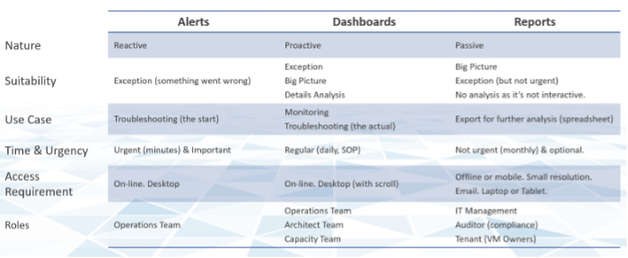

很容易認為儀表板、警報和報告是分開的，應該獨立設計。顧全大局, 這些功能的重疊最小，因為它們形成了一個 ***連續體*** . 它們服務於相同的目的，這是系統與用戶“溝通”的方式。

如果您應用這個想法，您將意識到您可以減少警報風暴，因為許多警報更適合作為儀表板的一部分。報告也將被最小化並保留給沒有在線訪問權限的角色和不需要交互的用例。

警報的性質意味著它的用例非常狹窄。您不想根據警報運行您的操作。太多了，你不知所措。太少，你缺乏大局的可見性。 Alert 僅適用於以下情況：

- 緊迫. 如果時間不是關鍵，那麼帶有儀表板的常規標準操作程序 (SOP) 會更有效，因為您可以看到全局。避免向不處理日常操作的角色發送警報。最好使用儀表板來執行諸如容量管理之類的長期操作。
- 問題. 如果沒有任何問題，則無需觸發警報。這就是為什麼通常您不設置庫存變化警報的原因，因為庫存只是某種事物的帳戶。
- 補救. 如果您無法立即採取任何措施來解決問題，為什麼要觸發警報？在這種情況下使用儀表板。
- 很少. Alert 關注異常，而不是大局。因此，您希望它最小化。如果整個房子都著火了，那麼警報就太遲了。

在光譜的另一端是報告。報告的性質意味著它的用例也非常狹窄。現代運營需要報告所缺乏的更豐富的交互。該報告僅適用於以下情況：

- 不互動 (例如用戶需要將其發送到他們的電子郵件收件箱)
- 離線 (例如，用戶在飛機上)
- 無法訪問 vRealize
- 印刷文件
- 持續時間（例如日曆月）
- 進一步處理 (例如與數據不在 vRealize 中的其他系統集成)
- 進一步分析和報告 (例如財務團隊希望將數據作為電子表格報告的一部分)

儀表板涵蓋了最廣泛的用例，因為它是最通用的。

下表詳細說明了 3 種參與方式如何互補。

如果用戶可以通過他們的桌面訪問在線，請考慮使用自助服務儀表板，因為他們不需要登錄並且更易於使用。您可以開發一個帶有這些儀表板和自定義指南鏈接的門戶。

vRealize Operations 的最後幾個版本引入了許多改變儀表板外觀的新功能。 vRealize Operations 8.2 具有增強的儀表板到儀表板導航，因此您可以在儀表板之間創建流程。您的儀表板不再局限於獨立的儀表板。

8.2 版附帶了一組經過改進的儀表板。它們保持簡單，旨在針對您的特定環境進行定制。在 vRealize Operations 8.4 中改進了儀表板。