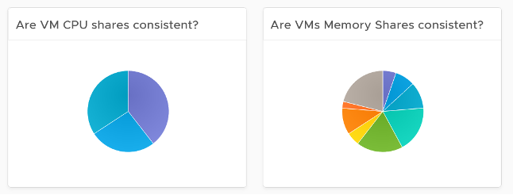

Use this dashboard to view the overall configuration of vSphere clusters in your environment, especially the configuration that need attention.

The dashboard is designed with the same considerations that are common among all the configuration management dashboards.

## How to Use

The dashboard is organized into sections for ease of use.

The first section shows 3 bar charts. They correspond to the 3 main features of vSphere clusters, namely High Availability HA, Dynamic Resource Scheduler DRS and Distributed Power Management DPM.

- **HA**: The best practice is to enable HA admission control. You can specify the Admission control Policy in vCenter and the threshold for failover shares.
- **DRS**: The best practice is to have DRS enabled. Think of a vSphere cluster as a single logical computer that balance within itself.
- **DPM**: The best practice is to enable DPM in an environment where environmental concern is the top priority or the high peak rarely occurs (most of the time You are running very low utilization).

The second section of the dashboard shows 8 pie charts. They show the relative distribution of key configurations.

- 2 bar charts cover Admission Control. You should enable admission control. The pie chart displays the policy code instead of the policy name, as it is based on the property `Cluster Configuration | Das Configuration | Active Admission Control Policy`. The mapping between code to name is:
  - -1 = Disabled
  - 0 = Cluster Resource percentage
  - 1 = Slot Policy (Powered-on VMs)
  - 2 = Dedicated Failover Hosts
- 2 bar charts cover the HA Failover Share, one for CPU and one for memory.
- 2 bar charts cover DRS setting. Generally speaking, you want to have DRS fully automated, meaning no operator intervention is required for both initial VM placement and subsequent load balancing, but with a moderate migration threshold (value = 3.0). The value range from 1.0 to 5.0.
- There are 2 pie charts showing reservation, one for CPU and one for memory. Minimize the total reservation value as it prevents overcommit of resources and hence results in a less optimal utilization. Memory reservation can remain and occupy the memory space of the ESXi host even though the VM does not use the memory anymore. Consider the analogy of unused files that you have not opened for months in your laptop c:\ drive. They still take up space of the hard disk. Keep the number of distinct shares below three (or at a minimum), matching the distinct classes of service.

The third section of the dashboard shows 2 bar charts. They show the absolute distribution of cluster.

- The first shows the cluster grouped by the number of ESXi Hosts. Ensure this matches your plan and cluster sizing standards.
- Small clusters (defined as having less ESXi hosts) have higher overhead while large clusters have a higher risk in case of cluster-wide outages. For large cluster, have a disaster recovery plan an unexpected cluster-wide outage can impact many VMs.
- Performance risk is lower in large clusters partly because there are more nodes that DRS can tap on, but if there is an actual problem troubleshooting can be harder (because there are more nodes to analyze).
- In large environment, small clusters can result in cluster sprawl.

The fourth section of the dashboard lets you drill down into individual cluster.

- It begins with a table listing all the clusters with their key configuration. You can export this list as a spreadsheet for further analysis or reporting.
- Select a cluster. The list of ESXi Hosts under the cluster, along with shares and resource pools information, is automatically filled up. Ensure as all its ESXi Hosts have identical configuration.
- Keep the number of distinct shares below three (or at minimum), matching the distinct classes of service. You should avoid giving different service level to individual VMs as that increase the complexity of the cluster performance.
- Verify that Shares are used consistently throughout your entire vSphere environment. Do note that they are relative numbers, not absolute. Ideally, avoid using it altogether as it's easy to overlook. When you move VM to another cluster or vCenter, you may forget to set the new share appropriately.

- Keep the number of resource pools minimal. Resource Pools can impact performance, if the number of VMs in the pool do not match its intended shares. The new **Scalable Shares** feature in vSphere 7 automates this adjustment, which has to be done in older version. More about it [here](http://www.yellow-bricks.com/2020/03/16/vsphere-7-and-drs-scalable-shares-how-are-they-calculated/).
- Some of the columns are color coded to facilitate quick reviews. Adjust their threshold to either reflect your current situation or your desired ideal state

## Points to Note

- The number of buckets on the pie chart or bar chart are balanced between the available screen estate, ease of use and functionality. Modify the buckets to either reflect your current situation or your desired ideal state.
- In a large environment, create a filter for this dashboard. Group by the class of services such as, Gold, silver, and bronze. Default the selection to Gold. In this way, your monitoring is not cluttered with less critical workloads.
- You might notice that the **DRS Migration Threshold** widget is using the property **DRS vMotion Rate**. This is the correct property. We will correct the property name so it's less confusing.
- The **HA Memory Failover Shares** widget should be named **HA Memory Failover percentage**. This is a known typo.
- The **HA CPU Failover Shares** widget should be named **HA CPU Failover percentage**. This is a known typo.