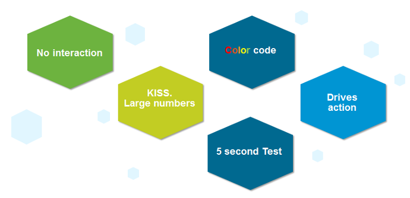
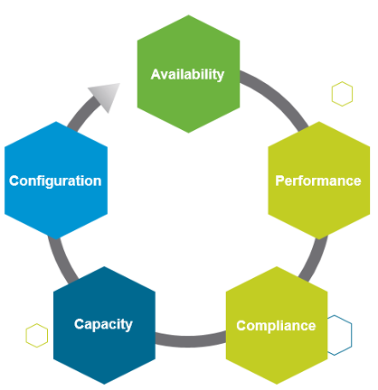

A dashboard projected on the large screen serves a different business purpose than a dashboard on your laptop or desktop. It is placed strategically because it displays a *time sensitive* information. The information presented is more urgent in nature than alerts (otherwise you simply use alerts!) and is used to complement alerts.

These dashboards are specifically designed for your Network or Server Operations team, who are typically stationed at the NOC. Dashboards aid your operations team to proactively monitor the health & availability of the VMware cloud infrastructure in near real time. Due to the specific purpose of it, not all operational use cases are suitable for these. For example, [Capacity](/operations-management/chapter-3-capacity-management/) and [Cost](/operations-management/chapter-5-cost-management/) use cases are not highly time critical. They tend to stay static for hours, rendering them unsuitable for live screen.

The following five principals are used to design the predefined Network Operation Center dashboards.

## Color Coded

All the information is color coded to classify the severity of the issue.

- Color is easier to digest than text, as you don't even need to read. Lots of text can confuse viewers. Text can be hard to read from afar.
- Use key colors (green, yellow, amber, and red).
- By default all green. Can't have red staying for hours (use alerts for something less urgent)

## No interaction on the projected screen

- 0 interaction, because there is no mouse and keyboard.
- Toolbars & buttons should not be used as they add confusion as there is no way to use them.
- Most widgets are not suitable as a result.

## KISS - Keep It Simple Show

- These dashboards are designed to show you minimal & critical information only. It should follow the [KISS](https://en.wikipedia.org/wiki/KISS_principle) principle.
- Don't show detailed charts as that is hard to read from afar. Be aware of how far the info needs to be displayed. 9 point Calibri at laptop is clear, but not at the projector screen.
- Ideally, all the numbers are in %, with 0 being bad and 100 being perfect.
- In cases like Utilization, you should use the following marker.
  - 50% = good, balanced utilization. Ideally, this should be 75%.
  - 0% = wastage
  - 100% = highly utilized.

## Remember the 5-second test

- All NOC dashboards should be easy to interpret, user friendly and do not require an explanation.

## Choose content that drives immediate Actions

- Focuses on immediate remediation. Remediation action has to be immediate (within the same hours). If something can't be fixed within the same day, why show it live? Remediation that takes >1 day should not be shown, as the dashboard will be red for hours. It is better to use alerts for longer remediation window.
- If you display something that is red most of the time, after a while the viewer will ignore it. This defeats the very purpose of displaying on the big screen.
- When something on the big screen is red, you want action to be taken. And it's immediate, not tomorrow.
- It's showing 5 minute data. Live! The history not so relevant, because it focuses on urgent remediation.
- Problems that don't require immediate attention should be avoided, as they are distraction.
- Examples of suitable actions: stop provisioning of new VM, take action on VMs that abuse the shared infrastructure.
- Examples of not suitable actions: Increase supply of infrastructure, such as adding hardware.

## Designed to be displayed on a big screen

- Configure them to auto-rotate in a logical flow.
- Each dashboard is designed to fit the screen & no scrolling is required.

The above principle applies to the part of the dashboard that is projected on the big screen. You can dual-purpose the same dashboard, to cater for the operators in the NOC room. These help desk administrators should have the same dashboard on their desktop or laptop. They can then use keyboard and mouse to interact with the dashboard, enabling them to drill down and find out more information.

vRealize Operations provides 3 sample dashboards in this release. Tailor them to your operational needs.

Availability is not part of them because there is no information to distinguish between planned downtime and outage. A planned downtime can last hours, making the NOC screen displaying red for too long. If you have a set of mission critical VMs or clusters that need to be up all the time, then create a group.

