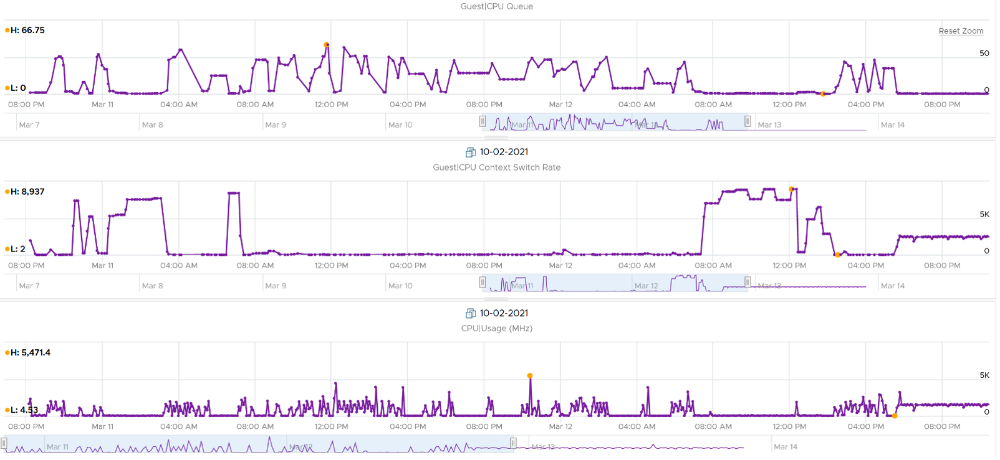
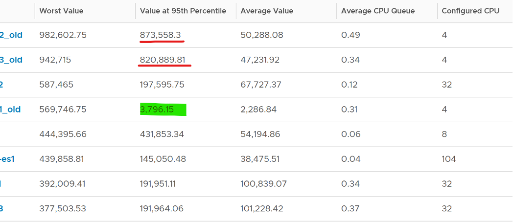
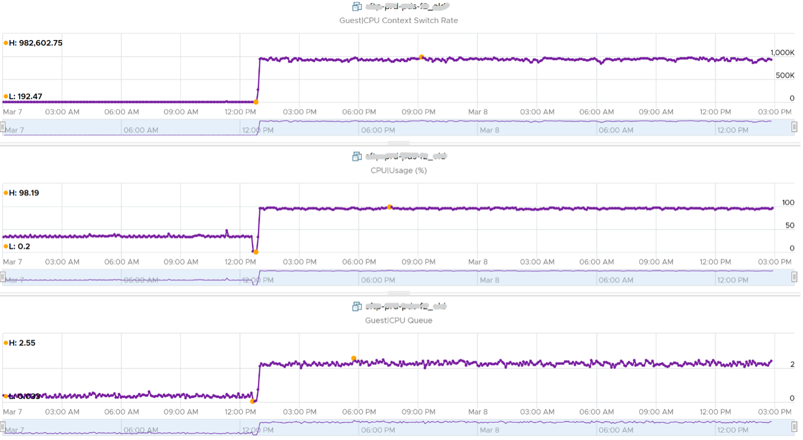
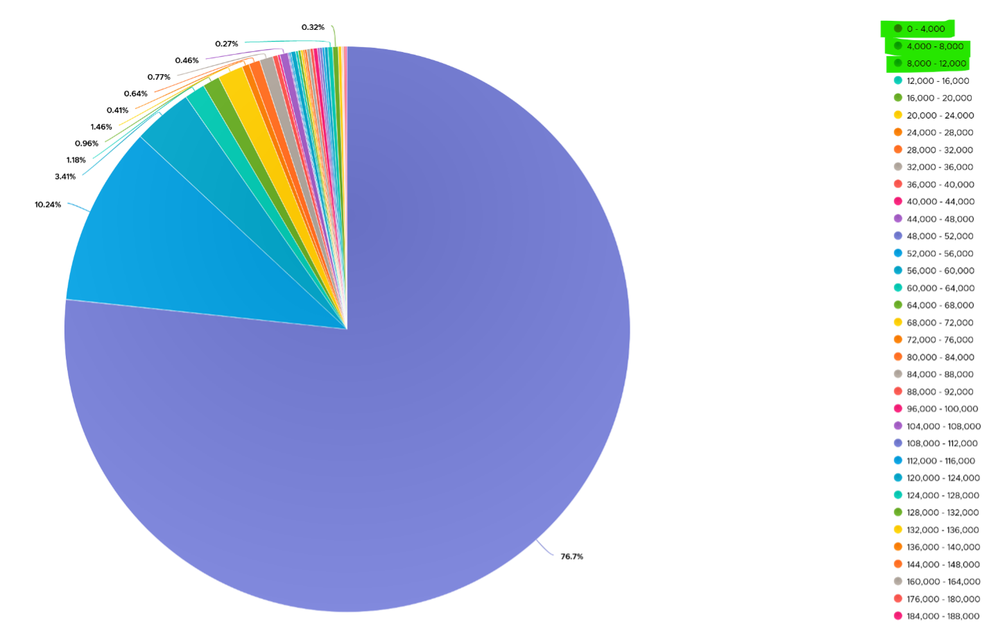
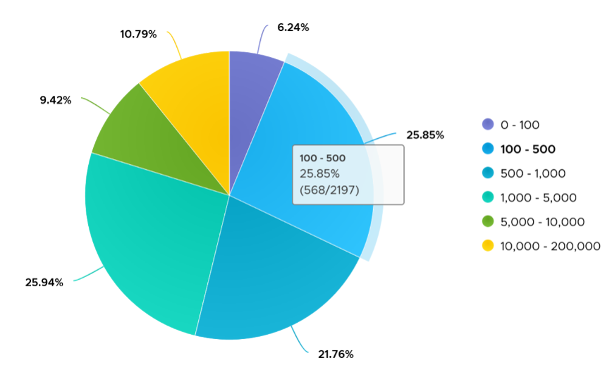
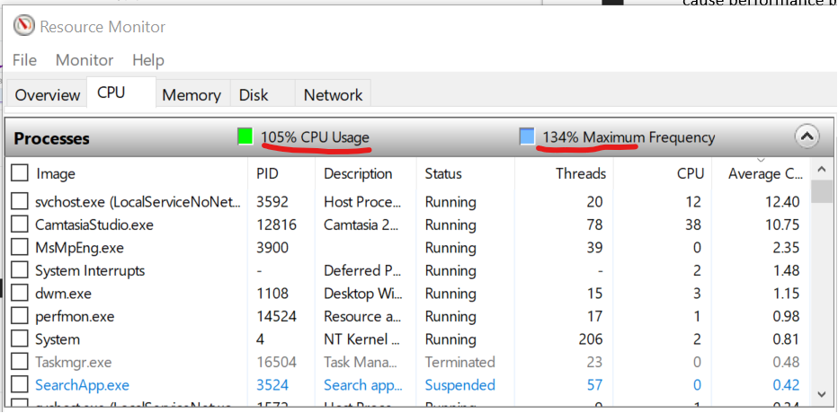

我們從 [要衡量的競爭類型](/zh-tw/operations-management/chapter-2-performance-management/1.2.4-contention-vs-utilization/) 因為這是衡量性能的主要衡量指標，其次是衡量指標的利用類型。

ESXi 無法看到來賓操作系統如何調度其進程，因此無法監控來賓操作系統。 ESXi 只能看到來賓發送的內容。在客戶操作系統內部運行的 VMware Tools 能夠查看客戶操作系統內部。為此，需要 VMware Tools 10.3.5 或更高版本以及至少 vSphere 6.0 P08、6.5 P03 和 6.7 U1。

## 來賓操作系統 CPU 運行隊列

處理器隊列中的線程數。對於 Windows，此計數器不包括正在運行（正在執行）的線程。對於 Linux，它包括 CPU 管道中的線程。

讓我們以配置有 8 個 vCPU 的 VM 為例。來賓操作系統有 8 個線程，因此最多可以調度 8 個並行進程。如果有更多的需求，它將不得不排隊。這意味著需要在來賓操作系統大小調整中考慮隊列。

因為它報告隊列，所以這是衡量客戶操作系統性能的主要計數器。它告訴您 CPU 是否正在努力滿足需求。

什麼是健康價值？

Windows 性能監視器 UI 描述與 MSDN 文檔（基於 Windows Server 2016 文檔）不一致。一份文件指出，超過 2 個線程的持續處理器隊列通常表示處理器擁塞。但是，另一個聲明“每個處理器少於 10 個線程的持續處理器隊列通常是可以接受的，這取決於工作負載”。 SQL Server 文檔將 3 作為閾值。如果您看到 Microsoft 或 Linux 的其他推薦，請告訴我。

Windows 或 Linux 利用率可能為 100%，但只要隊列較少，工作負載就會盡可能快地運行。添加更多 vCPU 實際上會降低性能，因為您有更高的上下文切換機會 [上下文切換](/zh-tw/metrics/chapter-2-cpu-metrics/2.2.1-guest-os/#來賓操作系統-cpu-上下文切換).

即使在具有多個處理器的計算機上，處理器時間也只有一個隊列。因此，如果計算機有多個處理器，則需要將此值除以服務於工作負載的處理器數量。這就是工具報告隊列總數的原因。此計數器應在客戶機操作系統 CPU 大小調整中發揮作用。 [來賓操作系統 CPU 大小調整](/zh-tw/operations-management/chapter-3-capacity-management/1.3.12-rightsizing/#來賓操作系統-cpu-大小調整).

您應該分析您的環境，因為某些 VM 的數量可能很高。看看我在下面得到的數字，其中一些 VM 每個 vCPU 有超過 10 個隊列。與 VM Owner 共享發現，因為減少隊列的補救措施可能意味著更改應用程序設置。

讓我們深入查看第一個 VM。

CPU 運行隊列多次出現峰值。它與模式中的 CPU 使用率和 CPU 上下文切換率不匹配。我不確定如何解釋這一點，所以如果你知道給我留言。我注意到數據收集不穩定，所以讓我們看看另一個虛擬機。

以下是運行 Photon OS 的 2 vCPU VM。 CPU 隊列很高，即使 Photon 僅以 50% 運行。會不會是應用程序配置了太多線程導致 CPU 忙於進行上下文切換？請注意 CPU 隊列映射 CPU 上下文切換率和 CPU 運行。在這種情況下，您應該提請應用程序團隊注意，因為它可能會導致性能問題，解決方案是向內查看。為了證明這不是因為底層爭用，我添加了 CPU Ready。

此屬性僅顯示最後觀察到的值；這不是平均值。 Windows 和 Linux 也不提供最高和最低的變體。

對於 Linux，我們使用 /proc/stat（內核/系統統計信息）中的 procs_running 值。它顯示處於可運行狀態的進程數。它與 /proc/loadavg 中的值相同。它是所有 CPU 線程運行隊列的總和。 nr_running 字段包括當前正在運行的任務和就緒但未運行的任務。

參考: [Windows](https://msdn.microsoft.com/en-us/library/aa394272(v=vs.85).aspx) 和 [Linux](http://man7.org/linux/man-pages/man5/proc.5.html).

## 來賓操作系統 CPU 上下文切換

[CPU 上下文切換](https://en.wikipedia.org/wiki/Context_switch) 成本性能“由於運行 [任務調度程序](https://en.wikipedia.org/wiki/Scheduling_(computing)), TLB 刷新，間接由於共享 CPU 緩存 [CPU 緩存](https://en.wikipedia.org/wiki/CPU_cache) 在多個任務之間”。跟踪此計數器並至少了解該特定應用程序可接受的行為是很重要的。

根據 Windows 10 性能監視器文檔，上下文切換/秒是計算機上所有處理器從一個線程切換到另一個線程的組合速率。在其他條件相同的情況下，處理器越多，上下文切換就越高。

{}
線程切換可以發生在單個多線程進程內部或跨進程。線程切換可能是由一個線程向另一個線程請求信息引起的，或者是由一個線程被另一個更高優先級的線程搶占而準備運行引起的。
{}

System 和 Thread 對像上有上下文切換計數器。 vRealize Operations 僅報告總數。

Windows 或 Linux 每秒切換 CPU 上下文的速率範圍很廣。以下內容取自具有 8 個物理線程的 Windows 10 桌面，它運行大約 10% 的 CPU。我觀察到該值在 10K 到 50K 之間徘徊。

該值應該與 CPU “利用率”相關，因為理論上利用率越高，CPU 上下文切換的機會就越大。下圖顯示了近乎完美的相關性。每次 CPU 使用率上升時，CPU 上下文切換也會發生。

即使在單線程應用程序中也可能發生 CPU 上下文切換。下面顯示了具有 4 個 vCPU 的 VDI VM。我繪製了 CPU 使用差異與 CPU 上下文切換的關係圖。您可以看到使用差異高達 78%，這意味著最繁忙的 vCPU 和最空閒的 vCPU 之間的差距為 78%。這是運行一個安全代理，它不太可能被設計為佔用多個 vCPU。

讓我們繪製同一時期的上下文切換。同時出現一個尖峰，表示代理正忙於上下文切換。請注意，它並不總是必須如此。紅點表示即使 vCPU 使用差異上升，上下文切換也沒有峰值。

CPU 上下文切換 的值變化很大。它可以遠遠超過 50 萬，如下表所示，因此為該特定應用程序分析和建立正常基線非常重要。對 1 個 VM 健康的內容可能對另一個 VM 不健康。

從表中可以看出，有些虛擬機經歷了長時間的 CPU 上下文切換，而其他虛擬機則沒有。 VM #4 只有短暫的爆發，因為第 95 個百分位數的值下降到 3796。上下文切換的瞬時峰值可能不會導致性能問題，因此通常將值取在第 95 個和第 99 個百分位數之間的某個位置更為明智。

讓我們深入查看第一個 VM。這個只有 4 個 vCPU 的 CentOS VM 不斷地達到近 100 萬次上下文切換。模式匹配 CPU 使用率。

另一方面，大多數客戶操作系統的花費遠低於 10K。我分析了大約 2200 個生產虛擬機，這裡是它們的 CPU 上下文切換的分佈。可以看到0-12000之間的值佔了80%。

在您的環境中，您可以進一步分析它。在以下示例中，我通過將 10K 以上的所有值分組為一個存儲桶，並將 0 - 10K 存儲桶拆分為多個存儲桶來調整存儲桶閾值。您可以看到超過一半的 CPU 上下文切換率低於 1K。

## Linux竊取時間

根據 Red Hat 文檔, [Steal Time](https://access.redhat.com/documentation/en-us/red_hat_enterprise_linux/7/html/virtualization_deployment_and_administration_guide/sect-kvm_guest_timing_management-steal_time_accounting) 是虛擬機管理程序未提供的 VM 所需的 CPU 時間量。它發生在主機為其自己的進程或另一個來賓分配 CPU 資源時。

雖然 Linux 有此計數器，但它在 ESXi 上運行時為 0，因為默認情況下未啟用它。即使啟用，它也只考慮就緒時間。它不考慮其他時間，例如 CoStop、VM Wait 和內存等待。

CPU 就緒包括限制。我還沒有驗證 Linux Steal Time 是否考慮到了它。

## 其他客戶操作系統衡量指標

當 CPU 頻率高於標稱速度時，Windows 8 及更高版本將在任務管理器和性能監視器中報告 CPU 使用率 >100%。更改的原因與我們迄今為止所涵蓋的相同，即需要區分正在完成的工作量。更多在這裡 [這裡](https://docs.microsoft.com/en-us/troubleshoot/windows-client/performance/cpu-usage-exceeds-100).

參考: [Windows](https://msdn.microsoft.com/en-us/library/aa394279(v=vs.85).aspx) 和 [Linux](http://man7.org/linux/man-pages/man5/proc.5.html).