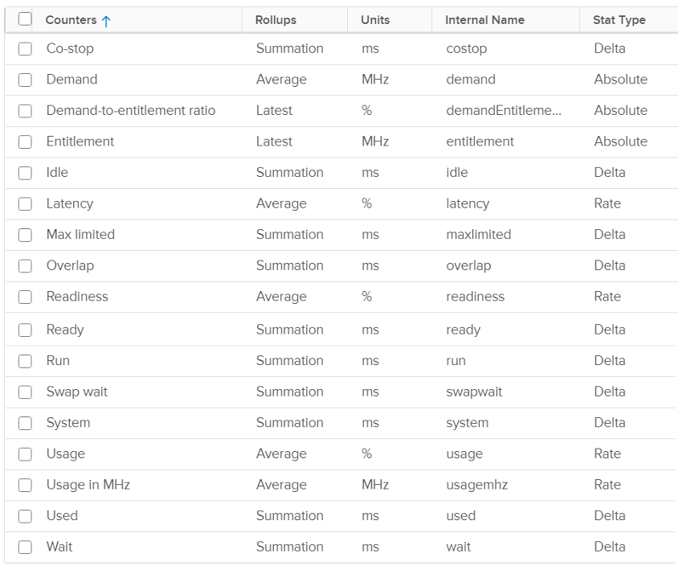

### 第2章

# CPU 衡量指標

這 [細微差別](/zh-tw/metrics/chapter-1-overview/2.1.1-nuances-in-metrics/) 您之前看到的是由於附加層的性質。下面的信息圖顯示了虛擬化帶來的多個元素。它幫助我理解衡量指標，因此分享。

VM 的 CPU 計數器與來賓操作系統中的不同。例如，vCenter 提供了 5 個計數器來說明 VM CPU 的利用率，但沒有一個直接映射到 Windows/Linux CPU 利用率。 ESXi 中的 CPU 計數器也不僅僅是其正在運行的 VM 和 VMkernel 的總和。

以下屏幕截圖顯示了 VM 的 CPU 計數器。與Windows等Guest OS相比，您是否注意到缺少什麼和增加了什麼？繼續並打開 Windows PerfMon 或 SysInternal 並進行比較，您會很快發現主要差異。

馬上，您會注意到 Windows 中不存在流行的計數器，例如 Ready、CoStop 和 Overlap。原因是 VM 和來賓 OS 具有不同的優勢。

當 VMkernel 取消調度 VM 以處理同一物理線程或內核上的其他內容（例如其他 VM、內核中斷）時，來賓操作系統不知道它為什麼會被中斷。事實上，它會遇到運行在物理核心上的特定 vCPU 的凍結時間。再次安排時間時，時間會跳躍。由於這種獨特的可見性，在正確的層使用正確的衡量指標很重要。以下是來賓操作系統可以看到和看不到的內容：

不同的有利位置導致不同的計數器。這會在您根據 VM 內部發生的情況確定大小時產生復雜性，但根據 ESXi 上 VM 佔用空間之外發生的情況進行回收。換句話說，您調整來賓操作系統的大小並回收 VM。

這兩層都需要監控，因為每一層都測量不同的性能問題。因此，必須安裝 VMware Tools，因為 VMkernel 無法提供對來賓操作系統的可見性。默認情況下，VMware Tools 每 20 秒向 ESXi 主機報告有關來賓的統計信息。

{}