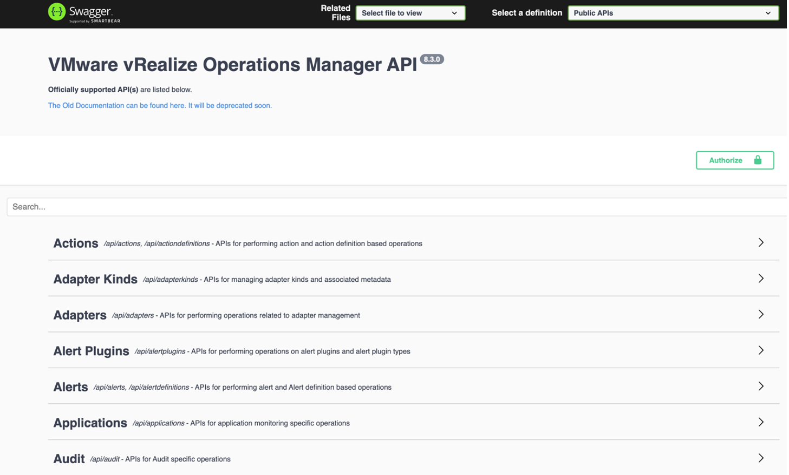
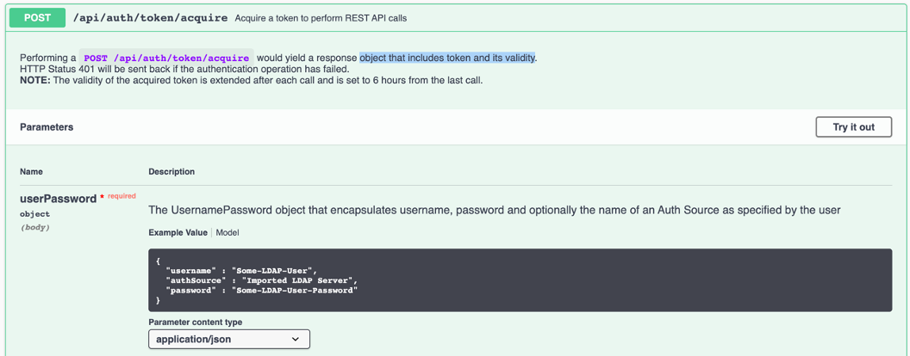
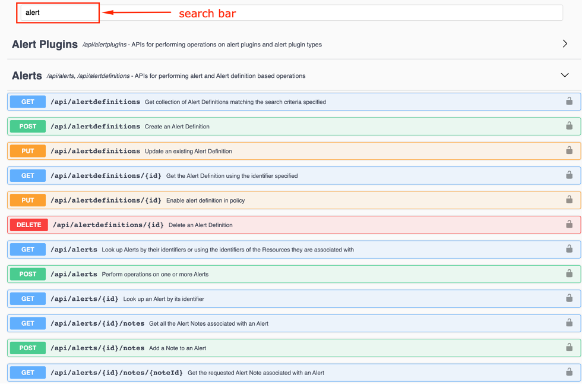
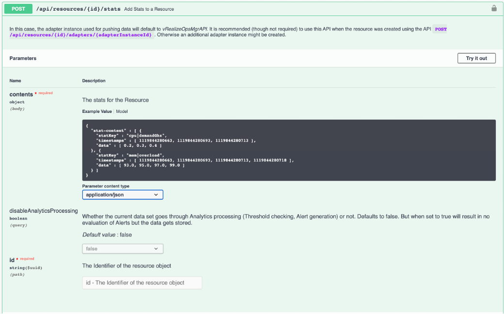

With the almost limitless capabilities of the vRealize Orchestrator adapter we are able to build sophisticated automation tasks and yet it is still an open loop.

Of course, we can implement the actual workflow to execute other workflows and possibly include other systems to contribute to the overall automation process but how do we close the loop back to vRealize Operations? And yes, you are right if you now say: "Hold on Thomas, we closed the loop, the action may influence the behavior of a certain object in vCenter, which in turn has impact on metrics collected by the adapter instance." This in fact may close the loop, but I would like to have something more tightly connected to the entity executing the action, something more powerful working really in context of my automated actions, giving me all options to quickly get back to vRealize Operations and immediately check the impact my actions have. Having the control over what objects I need to inspect, or retrieve additional data from to take more sophisticated actions.

What options do we have to get back to vRealize Operations and retrieve more information? Can we extend what vRealize Operations is managing with custom object types and metrics? Let's find out!

## REST API

vRealize Operations provides a comprehensive REST API for interaction with the solution. Since the 8.2 release the REST API documentation is accessible as Swagger UI and available on every vRealize Operations instance via: `https://vrops-fqdn/suite-api`

Swagger UI makes it easy to try out the available methods before the actual implementation in code. The first step, no matter if using the Swagger UI or within the actual implementation is the authorization. In the actual code we vRealize Operations requires the usage of the acquire POST method to retrieve an object that includes token and its validity. This token is used in the subsequent REST calls. The next picture shows the acquire token method in the Swagger UI.

The Swagger UI provides an easy way to find the appropriate method - just type in your search term and see what is available. In the next picture you can see the available methods around Alerts (shortened).

The REST API provides access to all managed objects, their metrics and properties as well as to vRealize Operations constructs like Alert and Symptom Definitions, Recommendations etc. With appropriate permissions one can not only read information, but new information can also be added to vRealize Operations. "New information" means entirely new custom object types with own set of metrics and properties as well as custom metrics and properties added to existing objects collected by vRealize Operations adapter instances.

The next picture shows the REST API POST method for adding custom metrics to existing resources specified by their vRealize Operations ID.

It is important to know that the available methods are divided into a group of definition of public API and an internal API. Please not, that the internal API should be used at own risk as the available methods may be changed or dropped in any upcoming release without further notice whereas the public API is considered stable.

An amazing use case building upon the vRealize Operations REST API is the vRealize Operations Export Tool (vrops-export) written by [Pontus Rydin](https://www.linkedin.com/in/prydin/). It is a utility for exporting data from vRealize Operations.

The newest version, as for the time of writing these words, can be found [here](https://github.com/vmware/vrops-export/releases/tag/3.0.0-BETA1).