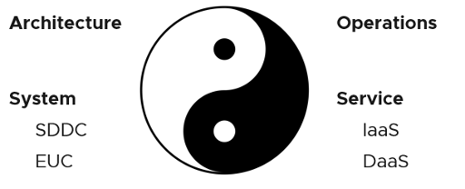
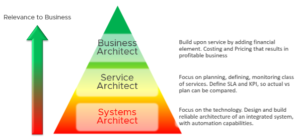

架构和运营是两个同样大的领域。虽然我们在设计系统时当然会考虑运维，但它不是架构的一部分。这本书是一个操作示例。请注意，它深入到指标中，因为故障排除是操作的核心。

架构和运营在其他行业也有所不同。设计航天飞机的人不是操作它的人。你需要成为一名宇航员才有资格操作航天飞机。设计 F1 赛车的人不是驾驶它的人。需要不同的专业知识。 它们相辅相成，相互依存，如 [阴阳](https://en.wikipedia.org/wiki/Yin_and_yang). 

由于基础设施正在成为一种服务，您需要知道如何构建服务（例如，IaaS、数据库即服务、桌面即服务）。

- IaaS 提供哪些服务？你如何定义服务？
- 你用什么指标来量化它的质量？
- 有多少服务？您如何区分优质服务和普通服务？

您还需要了解按需提供的服务类型。服务架构师走出去与客户会面以了解他们的需求。您现在和将来需要什么样的性价比？从那里，您可以构建相应的服务来预测需求。

作为业务架构师，您不仅知道运行服务的成本，还知道如何以及何时实现盈亏平衡。您不对盈亏负责，因为您不是云服务提供商的 CIO 或 CEO，但您确实是他们的战略顾问。您知道如何定价，如何定价，最重要的是您的价格具有竞争力（至少您可以提供商业理由）。

从我与客户的互动中，我注意到基础架构架构师并没有领导 Day 0 阶段。他们为规划阶段提供输入，但不是驱动它的首席架构师。基础架构架构师倾向于关注 **技术** 位，CFO 和 CIO 不太重视（因此他们花在这上面的时间较少）。他们也不架构操作。我看到许多经验丰富的 VMware 架构师并没有将他们的影响力扩展到架构之外。我认为这是一个失去的机会，因为第 1 天和第 2 天实际上是同一方的一部分。把它想象成 [莫比乌斯带](http://en.wikipedia.org/wiki/M%C3%B6bius_strip).

受 VCDX 计划的启发，多云运营领域可能需要 VCOX 计划。我们需要编写指南。这就是我开源本书的原因，因此所有运营专家都可以协作并产生最佳运营实践。

服务架构师和业务架构师是基础架构架构师的下一步。 我在 2014 年的一次演讲中分享了一位厨师和他的烹饪故事。 [VMUG session](https://www.vmug.com/).