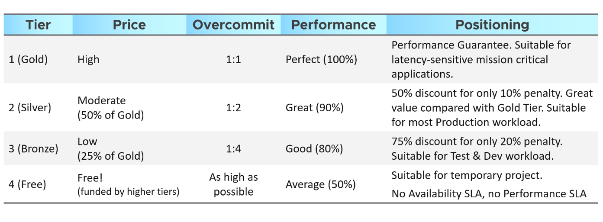
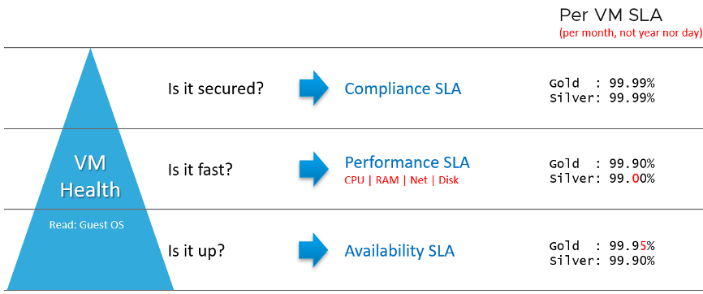

企業級雲和非企業級雲之間的區別在於 SLA。雲提供商可以聲明他們擁有最好的技術、最有經驗的專業人員、最具創新性的流程、行業認證等，以證明他們是最好的。如果他們害怕在他們的合同中用 SLA 來支持它，那麼所有這些都將無濟於事。 SLA 使客戶能夠追究雲提供商的責任，因為它會帶來經濟損失。

一旦定義了 SLA，客戶就想知道它將如何交付。這就是流程、架構、認證等的用武之地。什麼總是在如何之前。

## IaaS 的 4 個 SLA

IaaS 企業應提供三個 SLA，因為客戶需要全面覆蓋。

| SLA | 描述 |
| ------ | ----- |
| 可用性 | 這是最基本的SLA。它是最古老和最知名的。事實上，這在很大程度上是給定的。事實上，商定的數字是多少並不重要。如果這該死的事情失敗了，你最好在有人抱怨或事情變得更糟之前迅速提出來！ |
| 性能 SLA | 僅僅因為發生了一些事情並不意味著它會很快。虛擬機是可以啟動的，但是如果服務太慢，那就關掉就好了。性能 SLA 涵蓋了這一點並解決了基於投訴的操作 [CBO](/zh-tw/operations-management/chapter-1-overview/1.1.1-complaint-based-operations/) 通過定義什麼是快速的。它涵蓋了CPU、內存、磁盤和網絡，因此使用了四個指標。 |
| 遵守 | 這為行業法規或認證提供了安全合規性。 |
| 服務 | 以上三個SLA是由技術提供的。它們需要得到人類提供的服務的補充。這應該涵蓋主動和被動服務。兩個流行的例子是響應時間和解決時間。 |

## KPI vs. SLA

KPI 和 SLA 齊頭並進。

| 首字母縮略詞 | 描述 |
| :-------: | ----------- |
| SLA | 您與客戶簽訂的正式商業合同。通常，這是在 IaaS 提供商（基礎架構團隊）和 IaaS 消費者（應用程序團隊或業務部門）之間進行的。正式的SLA 需要運營轉型[OT](https://blogs.vmware.com/services-education-insights/services/operations-transformation-services). 它需要的不僅僅是技術更改，因為您需要查看合同、價格（不僅僅是成本）流程、人員等。如果違反 SLA，它往往會受到經濟處罰，例如下一個計費周期的信用。 |
| KPI | 這包括 SLA 指標，以及在違反 SLA 指標之前提供預警的相關附加指標。一個給定的 SLA 有很多 KPI，而 KPI 是 SLA 的先決條件。如果您沒有適當的 SLA，那麼在提交 SLA 之前先從內部 KPI 開始。首先了解並[分析](/zh-tw/operations-management/chapter-2-performance-management/1.2.10-baseline-profiling/) 你的IaaS的實際性能。使用 [此處](/zh-tw/operations-management/chapter-2-performance-management/1.2.10-baseline-profiling/) 中描述的分析技術，我分析了超過一百萬個數據點。 |

SLA 是 **每月** 計數器，而不是每天或每年。您使用整個月的數據來計算它。

時間線很重要。在下表中，請注意一年中的 99.999% 實際上比一周中的 99.95% 容易。您的客戶不會接受年度櫃檯，因為他們可能面臨長時間停機。你不會接受每日櫃檯，因為沒有錯誤的餘地。月度計數器在服務質量和提供服務的成本之間提供平衡。它還使報告更容易，因為您只需要跟踪日曆月。

每添加一個“9”，您的停機時間窗口就會減少 10 倍。這就是為什麼每個小數會花費更多的錢，因為可能需要不同的結構。

即使您每月測量一次 SLA，仍然難以滿足。看看下表。為簡單起見，我們將使用可用性 SLA 而不是性能 SLA，因為 up 或 down 是一個簡單的二進製文件。

如果您承諾 99.99%，那麼您每個日曆月只有 4.0 分鐘到 4.5 分鐘的停機時間。這意味著您的架構必須能夠檢測到問題，然後在短短幾分鐘內完成相應的修復。這是一個狹窄的操作空間。

適用於可用性但不適用於性能的獨特節省寬限期是計劃停機時間。沒有計劃的性能停機時間這樣的事情。特定於 IaaS，您可以建議計劃停機時間不包括在 SLA 中，只要它快速且很少完成即可。 VM 硬件升級、工具升級和 Windows 升級等計劃活動可以包含在計劃停機活動中。客戶造成的停機時間不包括在內，無論是否有意。這就是為什麼您需要兩個計數器：一個用於 SLA，一個用於實際。實際上，每次停機都會被記錄下來，無論它是否屬於 SLA 的一部分。

影響可用性但不影響性能的挑戰是恢復時間。您的系統可能會在 1 分鐘內檢測到 VM 已關閉，但是整個操作系統啟動並正常運行之前的重啟過程需要 5 分鐘，因為它需要執行文件系統一致性檢查。

KPI 是對 SLA 的補充，因為它跟踪的強度更大，涵蓋更多的計數器和事件。使用 vRealize Log Insight 處理更多時間敏感事件，因為 vRealize Operations 每 5 分鐘測量一次。

從上表中，請注意不包括來賓操作系統計數器，因為它是“應用程序 KPI”或 VM KPI 的一部分，而不是 IaaS KPI。它們會影響 VM 性能，但 IaaS 無能為力，這意味著修復是在來賓 OS 層完成的。

KPI 還通過為您的運營轉型提供墊腳石來補充 SLA。這是真正的業務 SLA 操作的必要步驟。

你從你站的地方走。首先使用 KPI。隨著時間的推移，確定您的實際可用性

## 服务水平

下表顯示了服務級別的基本和一般準則。考慮到技術和業務需求，您將實施的實際模型肯定會有所不同。在 [容量管理部分](/zh-tw/operations-management/chapter-3-capacity-management/1.3.3-capacity-planning/), 讓我們回顧一個實際的例子。

上表由他們的 SLA 進一步定義，因為您需要量化 10% 懲罰的確切含義。

金子 級別的 SLA 高於 銀 級別。為此，這意味著它們是根據相同的基准進行衡量的。

- 對於可用性，您可以根據理想情況衡量所有課程，即沒有停機時間。
- 對於性能，您可以根據相同的閾值來衡量它們，這是一個嚴格的（讀取：快速）數字。
- 對於合規性，您可以根據理想情況來衡量它們，即完美的合規性。
- 對於服務，您根據理想來衡量它們，這是最好的服務。

### 性能 SLA

讓我們詳細說明性能 SLA，因為它比其他兩個更複雜。

根據上圖，您提供 99.9% 金子 和 99% 銀 作為相應的 SLA。

對於黃金高於白銀，這意味著兩者都是根據_相同的原始閾值_來衡量的。換句話說，銀色環境中的虛擬機期望它不會像黃金環境中的虛擬機那樣頻繁地得到它需要的東西。如果 VM Owner 在性能方面想要更多 _可靠的_ 服務，那麼只需支付更多費用併升級到 金子 集群。

這種方法比為每一層設置不同的性能閾值更容易。假設您設置了以下內容：

- **金子**: 虛擬機內存爭用： 0.5%
- **銀**: 虛擬機內存爭用： 1.5%

你已經註意到問題了嗎？

很難解釋服務類別之間的增量或差距。為什麼銀價只有一半，價值卻是原來的三倍？不應該是成比例的嗎？

還有第二個問題。如果你設置_不同的_標準，白銀的表現可能會比黃金好，因為它的標準較低。這會造成混亂。

在操作上，設置單一閾值更容易。無需使用 vRealize Operations 策略。由於 SLA 閾值相同，您還可以在同一集群或數據存儲中使用混合類 VM。

我們將詳細介紹性能 SLA 中使用的計數器 [這裡](/zh-tw/operations-management/chapter-2-performance-management/1.2.6-performance-sla/).

### 差異化服務

IaaS 建立在商品硬件上，並作為實用程序提供。話雖如此，有很多方法可以讓您的服務與競爭對手區分開來。使用服務級別來區分高質量的服務。下表列出了一些示例。

| 服務 | 描述 |
| ------- | ----------- |
|備份 | 黃金級 提供應用程序級別的備份。它還提供更頻繁的完整備份，並為客戶提供自助式個人文件恢復。 |
|高可用性 | 黃金級 提供應用程序級別的監控。客戶還可以要求他們的 VM 的特定啟動順序，並要求 VM-Host 關聯規則以最小化風險。 |
|災難恢復 |黃金級提供較低的 [RPO 和 RTO](https://en.wikipedia.org/wiki/Disaster_recovery)。客戶還有權進行年度實際測試，其中生產工作負載從 DR 站點運行。 |
|快照 | 黃金級 提供更長的快照和更大的快照。 |
|操作系統管理 | 黃金級 提供了打補丁的靈活性。客戶可以指定補丁延遲和自定義補丁包請求，其中並非所有來自 Microsoft 或 Red Hat 的補丁都適用。 |
|虛擬機管理 | 黃金級 提供更新工具和 VM 硬件的靈活性。允許客戶推遲更新 |
|監控服務 |黃金級虛擬機將受到主動監控，而不僅僅是依靠警報。黃金層提供對運行客戶虛擬機的底層物理基礎架構的更深入的可見性。客戶有權獲得較低的內部指標，例如 vMotion 眩暈時間和 VMkernel 延遲。黃金層提供自助服務監控。客戶可以自己登錄到一個門戶網站，在那裡他們可以監控自己的虛擬機。他們可以啟動預定的停機時間。客戶將通過電子郵件和消息網絡收到警報。 |
|支持 |黃金級提供更快的響應時間、更長的工作時間和更快的解決時間。 |
|網絡| 黃金級 提供優先網絡。客戶可以選擇定期 ping 服務，以確保其應用程序之間的網絡延遲保持在商定的閾值內。 |
|譚 | 黃金級 配備一名技術客戶經理，作為客戶的單點聯繫方式 |