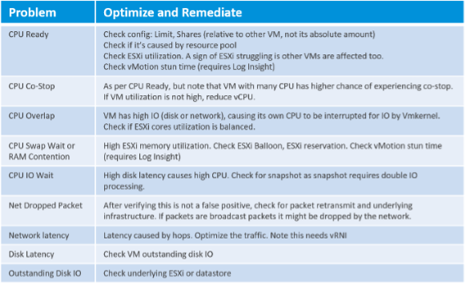

优化性能很困难，因为当利用率/吞吐量为 100% 时才能实现最佳性能。由于相互依赖的许多方面，在该级别上运行需要完美的掌握水平。

#### 垂直依赖

堆栈中有层，下层的问题会影响上层。

#### 水平依赖

IaaS 的四个要素不是独立的。当 CPU 暂停时，就来宾操作系统而言，RAM 和磁盘会随着时间的推移而出现延迟。

#### 流依赖

由于流量，NSX Edge 群集上的 NSX Edge 虚拟机中的问题可能会影响位于另一个群集上的业务虚拟机。如果您不了解流程，则可能会浪费时间在错误的集群上进行故障排除。

#### 版本依赖

“什么与什么一起工作”背后有正当的理由。并非所有组件的所有版本都能很好地协同工作，这是一个已知问题。驱动程序、固件等可能会导致互操作性问题，这可以表现为性能。

## 消费者层

消费者层由虚拟机和容器（通常在虚拟机内运行）组成。客户操作系统存在于其中，反过来又为进程运行提供了一个平台。因此，如果您正在运行容器，则会添加一个新层进行监控。如您所见 [此处](/zh/metrics/chapter-1-overview/)，添加新层会改变相邻层中的指标。如果您有容器监控方面的专业知识，请给我发电子邮件！

在流程级别，用于故障排除的有用信息似乎有限。下面展示了 [Windows Sysinternal](https://docs.microsoft.com/en-us/sysinternals/)，一个很好的 Windows 故障排除工具。如您所见，它们只是利用率计数器。

更多关于 [CPU 上下文切换](https://en.wikipedia.org/wiki/Context_switch) 被覆盖[这里](/zh/metrics/chapter-2-cpu-metrics/2.2.1-guest-os/#guest-os-cpu-context-switch).

由于提供了各种计数器，我们在 vSphere 虚拟机级别具有更好的可见性。下表列出了您可以为解决问题而执行的指标和相关操作。

我没有将 AWS EC2 或 Azure VM 放在这里，因为可见性相当有限。

现在让我们把来自客户操作系统和虚拟机的所有计数器放在一起。为了完整起见，我也添加了利用率计数器，因为 5 分钟的平均值可能太长了。

KPI 计数器对于某些用户来说可能过于技术化，因此 vRealize Operations 8.2 包含一个让他们入门的起点。它带有彩色编码仪表板。如果您认为仪表板小部件不符合您的要求，您可以调整它们的阈值。只有在您分析您的环境之后才这样做，而不仅仅是基于理论。

## 提供者层

在任何给定时刻，正在运行的 VM 始终驻留在 ESXi 主机上。由于 DRS 和 HA，更容易在集群级别进行监控。由于一个集群可以有数百个 VM，因此您需要能够代表集群中所有正在运行的 VM 的体验的综合指标。 vRealize Operations 8.2 提供以下衡量指标：

正在运行的 VM 还使用数据存储服务或具有 [原始设备映射 (RDM)](https://docs.vmware.com/en/VMware-vSphere/7.0/com.vmware.vsphere.storage.doc/GUID-9E206B41-4B2D-48F0-85A3-B8715D78E846.html) 磁盘.

以下是提供者层的潜在问题列表：

