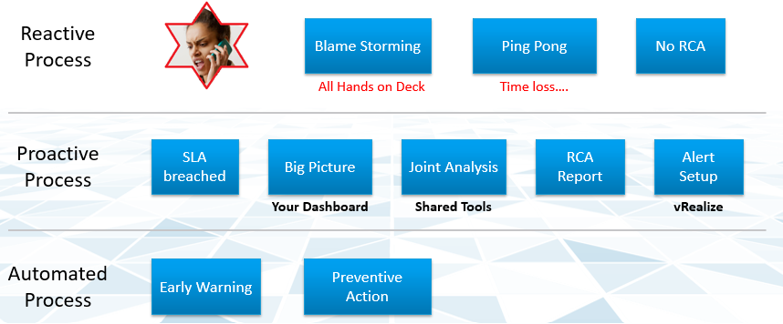

有很多事情可能会出错，尤其是在制作过程中和休假前夕。另一方面，您可以更改的设置相对有限。

我假设您已经遵循了配置最佳实践，因为这本身就是一个很大的话题。您需要查看并应用 Windows、Linux、vSphere、NSX、vSAN、服务器硬件和网络硬件性能最佳实践。如果您使用 Horizo​​n，那么您还需要应用其最佳实践，以及您的 VDI 架构中使用的第 3 方技术。在具有多个版本和供应商的大型环境中，可能很难确保整个堆栈兼容。这是一项永无止境的工作，因为您需要跟上版本和产品的生命周期。

假设你已经完成了所有的配置检查，那么你能做的剩下的事情就相当有限了。对于性能问题，它基本上归结为容量，虚拟机容量或基础设施容量。

vMotion 作为一个主题不断出现。如果您的应用程序团队有顾虑，[这篇](https://blogs.vmware.com/vsphere/2019/07/the-vmotion-process-under-the-hood.html) 文章深入探讨了它的工作原理和 [这](https://blogs.vmware.com/vsphere/2020/03/vsphere-7-vmotion-enhancements.html) 介绍了 vSphere 7 中的增强功能。

[根本原因分析](https://en.wikipedia.org/wiki/Root_cause_analysis) 报告因客户而异，即使他们解决的问题本质上是相同的。报告中排名第一的内容应该是什么？

报告的主要内容应该是设置为跟踪以防再次出现问题的警报。如果不设置此警报，您将无法检测到问题，并且可能会浪费宝贵的时间。

根本原因很可能与症状不同。它可能完全发生在不同的对象上，并且错误消息可能看似无关。根本原因通常以日志消息开始，这意味着它没有作为正式警报冒泡到屏幕 (UI) 中。当供应商支持团队向您推荐要捕获的特定日志消息时，您如何验证它是正确的？

您需要确保警报有效。这意味着它不应导致误报。

让我们举个例子。这是一个 [VDI](https://www.vmware.com/topics/glossary/content/virtual-desktop-infrastructure-vdi) 大规模断开连接问题，其中 >100 个用户的会话同时断开连接。分析认为问题出在“正在恢复DV端口的流量”，所以当它再次出现时我们需要捕获这个消息。

您需要做的第一件事是验证上述警报。使用 Log Insight 之类的工具，您可以针对整个环境交叉检查消息，尤其是健康环境（在本例中为未受影响的用户）。理想情况下，您可以交叉检查整个星期，而不仅仅是在事件发生期间。

以下是我在过去五个工作日内对所有用户进行交叉检查的结果。它发生了 1000 多次，这意味着“恢复 DV 端口上的流量”不是我应该基于警报的消息。他们太多了，并且在办公时间之后有一个明确的模式。

