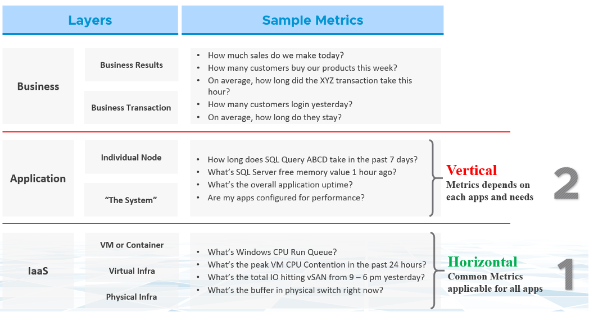
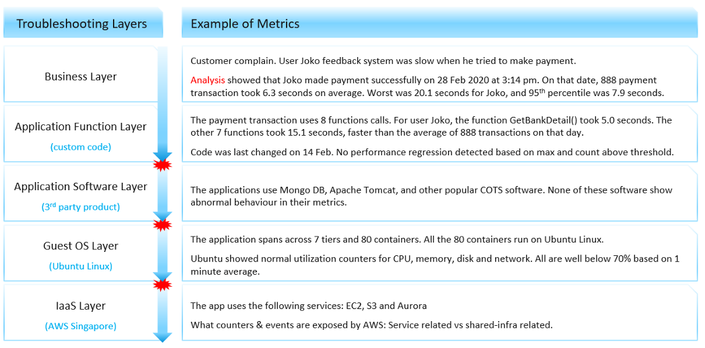

一般來說，企業應用程序有三個主要領域。每個領域都有自己的一組團隊。每個團隊都有一套獨特的職責，因此需要技能。下圖解釋了三個領域，以及每個領域的典型層次和提出的問題。

性能故障排除在很大程度上是一種消除練習。此方法對每一層進行切片並確定該層是否導致性能問題。因此，必須有一個指示符來指示是否正在執行特定層。這個主要指標被恰當地命名為關鍵績效指標。我們將在  [這裡](/zh-tw/operations-management/chapter-2-performance-management/1.2.7-kpi-vs-sla/#內部的-sla) 中介紹更多。

上層依賴於下層，因此基礎設施層通常是爭用的來源。因此，首先關注底層，因為它是上層的基礎。好的部分是，該層通常是一個水平層，它提供一組通用的基礎設施服務，而不管在其上運行什麼業務應用程序。

現在，我們不知道當基礎設施出現延遲時對 _application_ 的影響。這取決於應用程序。即使在相同的軟件上，例如 SQL Server 2019，影響也可能不同，因為這取決於您如何使用該軟件。即使在相同版本的軟件上，業務工作負載的不同性質（如批處理和 OLTP）也會受到不同的影響。

根據應用程序和基礎設施架構，可以有更多的堆棧或層。以下示例顯示了 5 個圖層。性能故障排除的挑戰在於層可能不共享上下文。

U用上面的例子，我們可以證明缺乏可見性是如何使故障排除幾乎不可能的。讓我們來看看上面的內容。故事從抱怨開始，因為這更能引起共鳴。

在業務層，您可以看到每個業務交易的表現。您不僅知道哪個用戶受到影響，還知道哪些交易受到影響，因為指標具有交易 ID。您可以在代碼中跟踪它，因為您知道每個函數調用發生的時間，假設您記錄每個事務。

當您超越代碼並進入貨架商業 (COTS) 軟件時，問題就開始了。軟件可能會顯示它的隊列是10000，比手冊上說它可以處理的多5000。但是您不知道用戶 Joko 事務是否在該隊列中。 COTS 軟件指標不再與用戶相關，更不用說單個交易了。紅色爆炸圖標標記上下文丟失的位置。

從應用程序轉移到基礎設施導致了另一個上下文丟失。 Windows 或 Linux 不知道您正在運行什麼應用程序。就操作系統而言，每個應用程序只是一個進程。它將報告每個進程的基本 CPU、內存、磁盤和網絡利用率。更高級的計數器在操作系統級別、系統範圍內報告。例如，您不知道您的進程是否經歷過網絡[丟包](https://en.wikipedia.org/wiki/Packet_loss)。數據包計數器丟失是一個系統範圍的指標。

從單個 EC2 或 VM 遷移到共享基礎架構會導致另一次上下文丟失。在公共雲的情況下，您可能根本無法了解物理層。