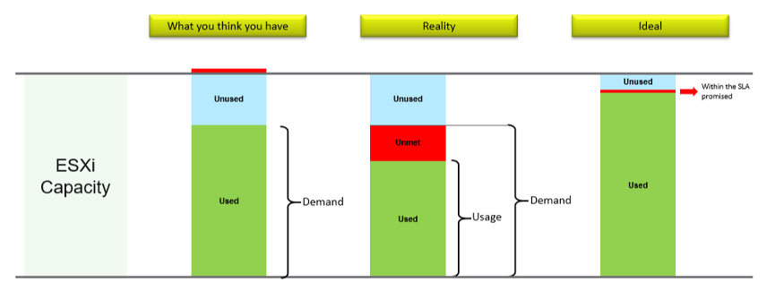
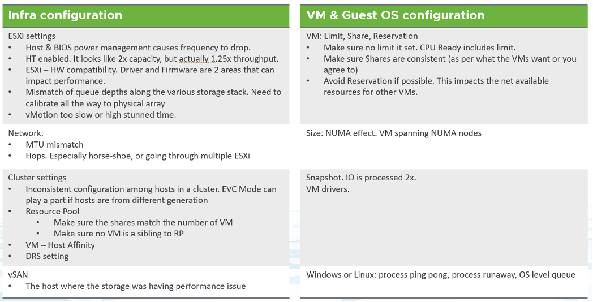

在 VM 层，我们关心特定的 VM 是否被平台很好地服务。从 VM 所有者的角度来看，其他 VM 无关紧要。因此，这里的关键计数器是 VM 争用。基础设施指标无关紧要。只有当我们对没有争用感到满意时，我们才能继续检查 VM 的大小是否正确。大多数人首先检查利用率，因为他们习惯于在物理基础设施中进行监控。在虚拟环境中，我们应该首先检查争用。

大多数原始指标可以分为 3 种类型：

- 他们衡量一些 **坏**（例如争用、延迟）
- 他们衡量一些 **好的**（例如利用率、消费）
- 它们说明某些内容（例如库存、配置）

因此，消费，也称为利用率，是一系列指标。它有许多不同的名称（IOPS、吞吐量、使用情况、需求、活动等）。它的对立面是争用类型的指标。利用率是计数器容量系列（剩余容量、剩余时间、VM 剩余、推荐大小）的主要来源。

竞争是性能的主要计数器系列，而利用率是容量的主要计数器系列。 Performance & Capacity 以不同的方式使用这两种类型的计数器。了解每个需求对于优化性能和容量至关重要。

大多数人关注 **利用率**，因为他们担心如果它很高，就会发生错误。那个“东西”就是争论。争用表现为不同的形式。它可以是队列、延迟、丢失、丢弃、中止、上下文切换。

下图显示了三种不同的场景

- 你认为会发生什么。您从理论上讲，只有在利用率高时才会发生争用，而未使用的容量充当缓冲以防止发生未满足的需求。
- 在大多数环境中实际发生的情况。由于次优配置或限制，即使利用率不高，需求也未得到满足。
- 如果您的环境得到优化，会发生什么。您的利用率非常高，但仍将未满足的需求保持在承诺的 SLA 内。

不要将 **“超高”** 利用率指标混淆为性能问题。只要没有队列或争用，高利用率不会影响性能。仅仅因为 ESXi 主机正在经历膨胀、压缩和交换，并不意味着您的 VM 存在内存性能问题。您可以通过主机为其 VM 提供服务的程度来衡量主机的性能。虽然它与 ESXi 利用率有关，但性能指标根本不基于利用率。它基于争用指标。

利用率不是性能的计数器。这是容量的计数器。利用率越高，完成的工作就越多，因此性能就越好。 100% 的利用率实际上是最好的性能，只要没有争用。由于我们可以明确地跟踪争用，性能计数器成为次要的，支持计数器。

下图显示了典型 IaaS 中的所有层，重点是消费者端。

争用高于利用率，因为这是您应该推动运营的因素。正如 [Mark Achtemichuk](https://blogs.vmware.com/vsphere/author/mark_achtemichuk) 在 [这篇文章](https://blogs.vmware.com/vsphere/2015/11/vcpu-to-pcpu-ratios-are-they-still-relevant.html)，由竞争驱动。对于每一层，您都有一组指标。黑线显示争用是性能的主要计数器，而利用率是容量的主要指标。

绿线显示争用计数器通过显示需要多少额外容量来为容量提供有价值的输入。例如，应该使用 CPU 中的队列数来确定要添加的 CPU 数量。

蓝线表示下层的竞争直接影响上层的性能。例如，如果来宾操作系统遇到磁盘延迟，应用程序将感受到影响。这可能会对顶层产生涟漪效应。

红线不是实线，因为它显示了一种误解。如果争用 = 0，那么 100% 的利用率实际上是最高性能。如果我们无法衡量争用情况，则添加缓冲区（例如 90% 的利用率），因为队列往往会以高利用率发展。另一方面，在低利用率的情况下性能可能很差。很多事情都会导致这种情况。这里只是一些。

