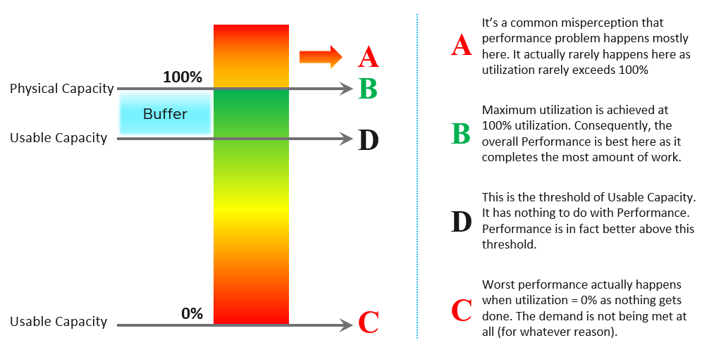

容量和性能之間的關係因對象而異。消費者對象（例如 VM、K8S Pod）與提供者對象（例如 vSphere 集群、vSAN 集群）具有不同的性質。對於提供者對象，性能始終是自下而上的。您從在提供程序對像中運行的 VM 開始，然後聚合指標。容量總是自上而下的。你先看大局，然後再深入。例如，您從 vSphere 集群開始，然後深入到 ESXi。

對於 IaaS 提供商，下表說明了性能和容量的差異。

容量有 HA、Buffer、Overhead 和 Reservation。這些都與性能監控無關。在性能中，您不關心它們，因為性能與現實有關（實際發生的情況）。它們可能會導致性能問題，但不會在性能指標中考慮。

性能和容量的混淆在於利用率。它們共享相同的原始計數器，但使用方式不同。性能是絕對的（實際值），容量是相對的（取決於設置）。下表顯示瞭如何不同地使用利用率。

以 ESXi Memory Consumed 為例，它是 ESXi 的主要利用率計數器。

- 從性能監控來看，100% 消耗不僅好，而且完美。您正在最大化緩存。只要沒有膨脹和爭用，這正是您想要的。
- 從容量監控來看，100% 消耗並不好，因為這意味著沒有更多剩餘容量。您需要停止供應新負載並開始購買新硬件的過程。此外，100% 是在扣除 HA 和緩衝區後測得的可用容量。它不是根據絕對體能來衡量的。

讓我們舉一個例子來看看爭用和利用率有何不同。下面以集群對象為例。有兩個計數器，每個計數器都以百分比表示。

您希望利用率盡可能高，因為您已經為硬件付費了。因此，您從 0% 開始，但希望盡可能向上移動。

你希望你的表現保持在 100%。你不希望它向下移動很​​遠。事實上，10% 的降級可能很重要，因為這可能意味著 10% 的 VM 群體受到影響。在具有 2000 個虛擬機的大型集群中，這可能意味著 200 個虛擬機。

性能取決於服務等級。 Gold 集群可能與 Bronze 集群具有相同的硬件，但在 Gold 集群上運行的 VM 面臨的爭用較少，因此它們的性能更好。

讓我們在現實生活中看看上面的內容。這是一個在過去 7 天內經常出現高利用率的集群。您可以清楚地看到峰值。集群有 14 個 ESXi 主機。

這裡的一個合乎邏輯的問題是對 VM 性能的影響是什麼？他們得到了他們要求的 CPU 嗎？該集群有 550 個正在運行的 VM。

這就是爭用計數器的用武之地。一個跟踪問題的深度，另一個跟踪問題的廣度。

CPU Ready > 1% 的虛擬機計數器百分比顯示出幾乎相同的模式。我們可以看到很大比例的 VM 人口受到影響。

第二個計數器跟踪深度，給出集群中任何 VM 經歷的絕對最差 CPU 就緒值。

