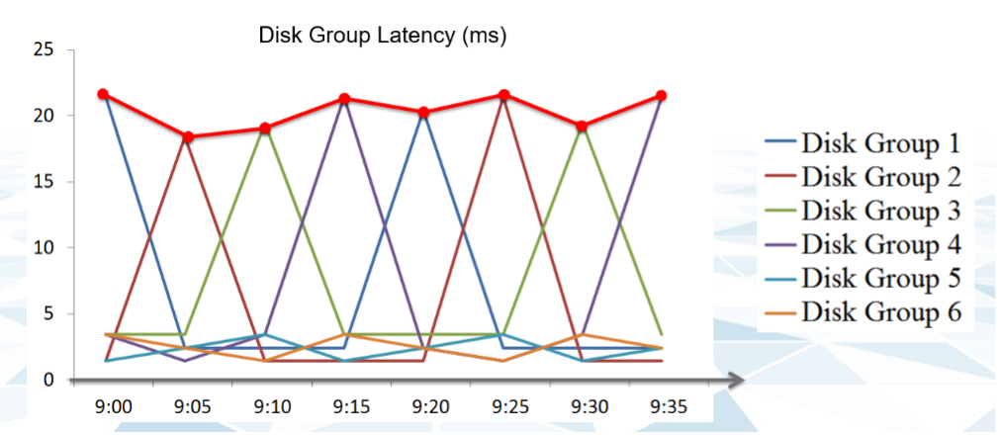
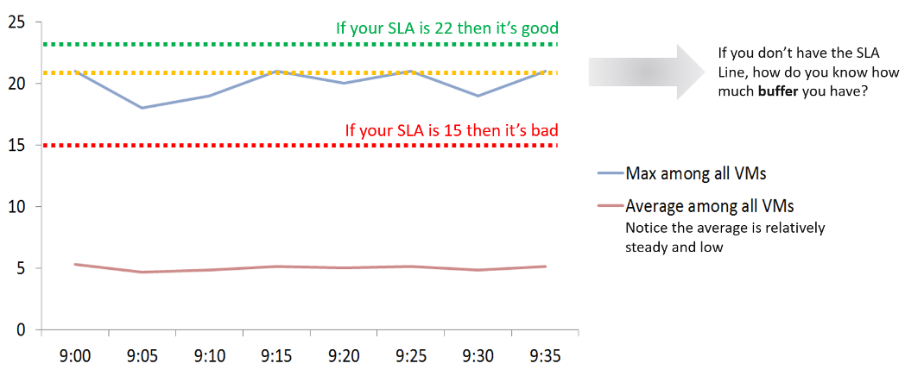

您从以下屏幕截图中注意到了什么？

请注意，最大值比平均值高出 10 倍以上。平均值相对于最大值也非常稳定。即使最大值变得更糟，它也没有移动。一旦集群无法应对，您就会看到这样的模式。几乎所有的 VM 都可以服务，但 1-2 服务不好。最大值很高，因为始终有一个 VM 未提供服务。

***小心*** 当您查看集群和数据存储等父对象的计数器时，average 是聚合中使用的默认计数器。查看以下集群级别图表。你注意到一个问题吗？

这是正确的。在过去 7 天内完全没有性能问题。集群运行良好。

这个集群运行了 100 多个虚拟机。您在上面看到的是在集群级别聚合的所有这些 VM 的平均体验。如果只有少数虚拟机有问题，但大多数都没有，则上述内容无法显示。

您需要的是一个集群级别的指标，用于跟踪是否有任何 VM 发生争用。我们有这个，结果很明显。

相同的模式，但比例是 6000%！

下图解释了这种事情是如何发生的。

上图显示了 6 个具有不同磁盘延迟的对象。粗红线显示 6 个对象中最差的延迟随时间变化。

绘制所有 6 个对象中的最大值，并取平均值，给我们两个不同的结果，如下所示：

该图表显示平均值可能仍远低于阈值，但一个或多个对象受到影响。平均数是稳定的。
只有当集群无法为大约 50% 的虚拟机提供服务时，平均数量才会变高。因此，平均值是一种糟糕的汇总技术。这是一个滞后指标。

主动监控需要从多个角度进行洞察。当您听说 VM 遇到性能问题时，您的下一个问题自然是：

- 有多糟糕？您想衡量问题的深度。严重性还可以提供根本原因的线索。
- 问题持续了多久？有什么模式吗？
- 有多少虚拟机受到影响？还有谁受到影响？您想衡量问题的广度。

注意你没有问 “什么是 _平均_ 性能？”​​。 显然，在这种情况下，平均为时已晚。当平均表现不佳时，可能有一半的人口受到影响。

第三个问题的答案会影响故障排除的过程。事件是孤立的还是普遍存在的？如果它是孤立的，那么您将更仔细地观察受影响的对象。如果这是一个普遍存在的问题，那么您将查看在受影响的 VM 之间共享的公共区域（例如集群、数据存储、资源池、主机）。

在计算问题的广度时，需要使用严格的阈值。没有这个，您将无法捕捉刚好低于阈值的值。另一方面，如果设置得太低，则会收到很多预警。

