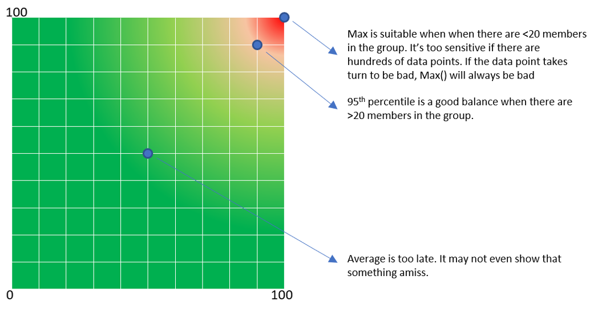

您希望能夠在早期發現性能問題，此時只有一小部分用戶或應用程序受到影響。為此，您需要一個領先指標。領先指標通過提供預警來補充滯後指標，讓您有更多時間做出反應。

平均值是一個滯後指標。大組的平均值往往較低，因此需要用峰值進行補充。另一方面，絕對峰值可能過於極端，包含異常值。

下表顯示了 Max() 找出極端（異常值）而平均值無法檢測到問題的位置。這就是 95% 或 99% 更有意義的地方。

這些是對average() 和maximum() 進行補充的技術。根據情況，您應用適當的技術。

#### Worst()

這將返回組的最差值。它適用於成員數量較少的情況，例如集群中的 ESXi 主機。

如果要忽略異常值，請使用 Percentile 函數。

在某些情況下，您可能同時需要最差和百分位數以獲得更好的可見性。

#### Percentile()

它類似於 Worst() 函數，但它在消除最壞的百分比後返回數字。例如，如果取第 99 個百分位數，則消除最差的第 1 個百分位數並取最高值。

成員數量必須支持百分位函數。如果只有 20 個成員，那麼每個成員對應 5 個百分位。你不能做 99%，因為這需要至少 100 名成員。

您需要相應地調整 percentile() 帶，考慮到數組中的成員數量。例如，如果您取 1 個月數據的第 99 個百分位數，您將消除最糟糕的 7.4 小時。另一方面，如果您取 1 天數據的第 95 個百分位，您將消除最糟糕的 1.2 小時。

#### Count()

這與 Worst() 或 Percentile() 不同，因為您需要先定義閾值。例如，如果您對性能不佳的 VM 進行計數，您需要定義什麼是壞的。這就是為什麼 Count() 要求您定義紅色、橙色、黃色和綠色的波段。然後您可以跟踪紅帶上的對像數量，因為您預計該數字始終為 0。在某些情況下，等到對像到達紅色區域可能為時已晚，因此請考慮用橙色區域中的成員計數來讚美它。

當成員數量非常大時，Count() 比 average() 效果更好。例如，在具有 100K 用戶的 VDI 環境中，受影響的 5 個用戶為 0.005%。使用計數更容易監控，因為您可以看到它如何轉化為現實生活。

#### Disparity()

當成員穿制服並打算平均分擔負載時，您還可以跟踪他們之間的差異。這揭示了當平均水平仍然良好時，該組的一部分何時遭受痛苦。

## 使用差異

您期望平衡的示例是：

- VM vCPU 之間的使用情況。如果 VM 有 32 個 vCPU，您不希望前 8 個受到影響，而後 16 個沒有使用。
- 集群中 ESXi 之間的使用
- 場中 RDS 主機之間的使用
- 在 Pod 中的 Horizo​​​​n Connection Server 之間的使用
- vSAN 磁盤組中磁盤的使用情況

有兩種計算不平衡的選項：

- 除以總數。這是一個固定數字，因為總數是一個常數。
- 除以最大值（最高）。這是一個動態數字，因為最大值在波動。不平衡是相對的，因為它取決於 Max 指標的值。

這兩個用例都有其目的。由於以下原因，我們首先使用：

1. 這是最常見的。第二個用例用於低級應用程序分析或調整，而不是一般的 IaaS 操作。
1. 也更容易理解。
1. 不平衡絕對值低時，不會導致高數。請參閱下面的圖表

以下計算表明，使用相對不平衡會導致較高的數字，這可能會產生誤導，因為實際不平衡僅為 10%

