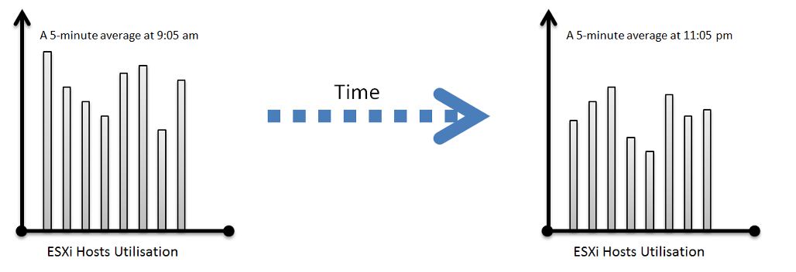

我們從客戶那裡得到的一個常見要求是需要調整峰值。我們經常看到定義峰值實際是什麼的錯誤，因為默認情況下，***平均值*** 會妨礙。

因此，讓我們詳細說明峰值。

您如何定義峰值利用率或爭用而不會過於保守或激進？

峰有兩個維度。您可以跨時間或小組成員衡量它們。

我們以一個有 8 台 ESXi 主機的集群為例。下圖顯示了 8 個 ESXi 利用率。

當天集群的最高利用率是多少？

此問題的問題在於一天有 1440 分鐘，因此每個 ESXi 主機至少有 288 個計數器（基於 5 分鐘的報告週期）。因此，該集群當天有 288 x 8 = 2304 個指標。真正的峰值必須是這 2304 個指標中最高的。

要獲得這個真正的峰值，您需要跨組成員進行測量。對於每個樣本數據，從利用率最高的主機獲取利用率。在我們的集群示例中，在上午 9 點 05 分，主機 1 的利用率是所有主機中最高的。假設它達到 99%。那麼我們認為上午9:05集群 ***峰值*** 的峰值利用率也是99%。

您對每個採樣週期（例如，上午 9:10、上午 9:15）重複此過程。您可能會在不同時間獲得不同的主機。您不會知道哪個主機提供了峰值，因為它會不時發生變化。

這個真正的高峰有什麼問題？

是的，它可能太敏感了。僅需要 2304 個指標中的 1 個。如果要忽略異常值，則需要使用百分位數。例如，如果您執行第 99 個百分位數，它將刪除最高的 ~23 個數據點。

請注意，最常用的方法是採用群集中所有 8 台 ESXi 主機的 _average_ 利用率。所以你失去了真正的峰值，因為每個數據點都變成了平均值。集群要達到80%的平均利用率，至少一台ESXi主機必須達到80%以上。這意味著您不能排除主機接近 100% 的可能性。

相同的邏輯適用於 VM。如果具有 64 個 vCPU 的虛擬機達到 90% 的利用率，則某些內核可能會達到 100%。這種方法會導致漏報，因為它在任何給定時刻取“成員”的平均值，然後隨著時間的推移（例如，過去 24 小時）取峰值。

這種“平均問題”在監控中基本上無處不在，因為它是聚合的默認技術。更深入的閱讀請查看 [這個](https://bravenewgeek.com/everything-you-know-about-latency-is-wrong/) 分析 [Tyler Treat](https://bravenewgeek.com/about-me/)。