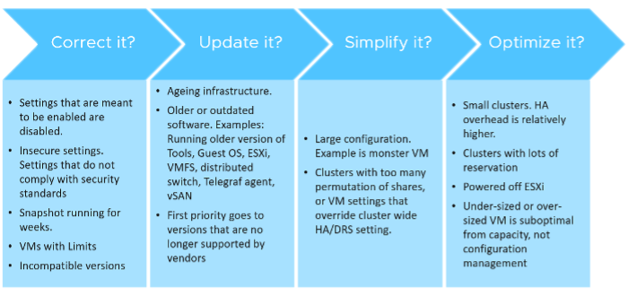

您需要管理数以千计的设置以确保安全性、性能和可用性。为确保首先跟踪和解决关键问题，请考虑对它们进行优先排序。 vRealize Operations 8.2 使用 4 步检查，从最紧急的开始。

#### 步 1

解决不正确、不安全、不符合公司标准或违反最佳实践的设置。你应该适当地纠正它们。

这通常是最紧急的步骤。

#### 步 2

设置是正确的，但在旧版本上。很难跟上所有供应商版本，因此您应该优先考虑最旧的版本，尤其是那些不再受支持的版本。

典型的 SDDC 或 EUC 架构跨越许多组件。虽然每个都可以运行最新版本，但它们可能不兼容或不支持。

#### 步 3

这些设置是正确且最新的，但它们会使您的 IaaS 操作复杂化。由于您不太可能将它们全部消除，因此应制定将它们最小化的策略作为简化操作的一部分。

#### 步 4

最后一步是关于成本和容量，因为没有问题。您希望最大限度地利用资源，同时最大限度地降低成本。这是一个平衡的行为！

-----

请注意，每个客户都以独特的方式经营他们的业务。每一个操作都像一个人的指纹。因此，适合其他客户的不一定适合您。即使在相同的环境中，适合开发环境的不一定适合生产。

下表列出了一些可能性。将它们用作输入以根据您的需要自定义配置仪表板。它提供了在 IaaS 消费者层中检查内容的示例。该层由 VM 和在 VM 内运行的所有内容组成，例如进程、应用程序、来宾操作系统和容器。

下表描述了 IaaS 提供商层。这一层由软件和硬件基础设施组成，例如 Telegraf、ESXi、计算集群、数据存储和数据存储集群、资源池、分布式虚拟交换机和端口组、vSAN、NSX 和硬件。

