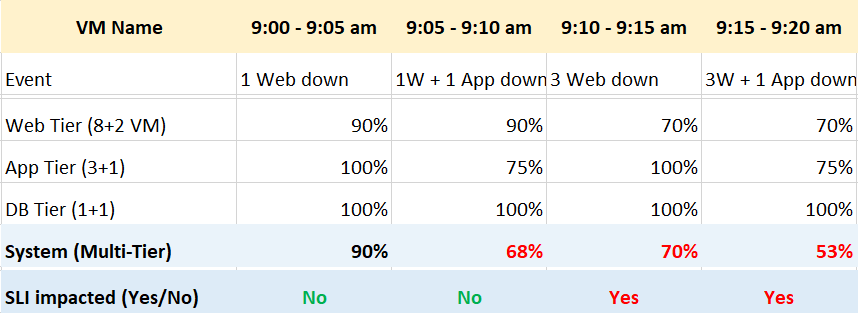

你能發現上述計算的局限性嗎？

提示：它在 1 個月內測量。

一個典型的月份允許 99.9% 的停機時間是多少分鐘？

大約43分鐘，如果發生在高峰時段，這是一個很長的時間。您可能會失去很多業務，更不用說客戶的不滿了。

上述計算的問題在於它是按月計算的。它沒有考慮到所有組件同時關閉與不同時間之間存在很大差異。查看下表，其中每 5 分鐘記錄一次正常運行時間。

上述系統有 3 層：Web、應用程序和數據庫。

Web 層的大小為 8 個虛擬機，另外還有 2 個虛擬機以提高靈活性。應用層設計為3+1服務器組。數據庫採用主動/被動設計。

讓我們逐步展示不同的場景如何影響可用性。

#### 9:00 - 9:05 am

- 1 個 Web 服務器已關閉。所有其他服務器都已啟動。為簡單起見，我們假設停機時間恰好為 300 秒。
- Web 層的正常運行時間變為 9/10 = 90%。
- 總體而言，系統正常運行時間為 90%。
- SLA 不受影響，因為 Web 層旨在處理 2 個故障。
- 儘管 SLA 不受影響，但重要的是要記錄正常運行時間並不完美的事實。

#### 9:05 - 9:10 am

- 1 個 Web 服務器 + 1 個應用程序服務器已關閉。所有其他服務器都在線。
- Web 層的正常運行時間變為 9/10 = 90%。
- 應用層的正常運行時間變為 3/4 = 75%。
- 總體而言，系統正常運行時間為 68%。
- SLA 不受影響，因為兩個層都沒有違反它們的閾值。

#### 9:10 - 9:15 am

- 3 個 Web 服務器已關閉。所有其他服務器都已啟動。 Web 層的正常運行時間變為 7/10 = 70%。
- 總體而言，系統正常運行時間為 70%。這比之前的 68% 高，但這次 SLA 受到影響，因為 Web 層不是設計來處理 3 次故障的。
- 從這裡您可以看到正常運行時間和 SLA 可能會有所不同。 - 前者是絕對的和技術性的，而SLA是相對於設計和任何合同的。

#### 9:15 - 9:20 am

- 與之前相同，但 1 個應用程序服務器已關閉。反映這種退化很重要，因此正常運行時間從 70% -> 53% 減少。
- SLA 不關心它，因為它只關心系統是在運行還是出現故障。在那5分鐘裡它是二進制的。

我們現在可以繼續整個月的日程安排。我正在稍微修改示例以說明 SLA 和現實可能不同的觀點。

從上午 9:00 到上午 9:30，系統從未有 100% 的正常運行時間。在本月剩餘的時間裡，它具有完美的 100% 正常運行時間。

SLA 僅經歷了 5 分鐘的中斷。所有其他停機時間都不會影響 SLA，因為系統已設計用於處理故障或計劃停機。

SLA 基於日曆月。以2021年2月為例，有28天。這在 5 分鐘內轉化為 8064 次。

#### SLA

- (8064 - 1) / 8064 = 99.988%
- 如果 SLA 為 99.95，那麼您將通過 2021 年 2 月。

#### 現實

- 平均值 (34% + 3.75% + 0 + 0% + 34% + 34% + 100% + 100% + 100% + ...)
- 是的，我們只是對構成 2021 年 2 月的所有 8064 個數字求平均值。
- 結果是 99.939%

現實與 SLA 之間的差距提供了有價值的輸入。